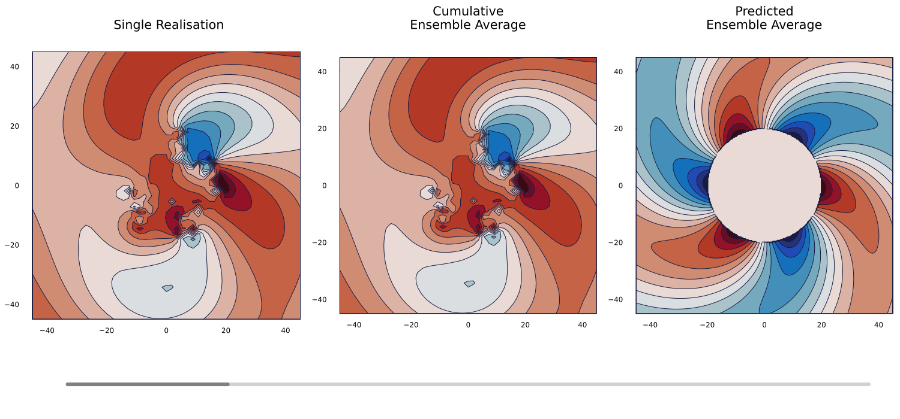

# EffectiveTMatrix.jl

[](https://doi.org/10.5281/zenodo.10529120)


**EffectiveTMatrix.jl** is a Julia package for simulating wave scattering in media composed of randomly packed particles. It implements the *Effective Waves Method* as described in [Napal et al. (2024)](https://royalsocietypublishing.org/doi/full/10.1098/rspa.2023.0660), enabling efficient computation of the scattering after ensemble averaging over particles configurations.

The package also includes brute-force Monte Carlo simulations to validate the accuracy and convergence of the effective model against direct ensemble averages.

Beyond numerical validation, there are industrial applications that need a method to calculate waves scattered from a cylinder with particles. Examples of cylinders filled with cylindrical particles include concrete beams reinforced with iron, cables filled with wires or fibre-reinforced composite. Applications include designing cylinders with exotic effective properties or developing methods to measure the cylindrical particles.

**Reference:**

[[Napal et al. (2024)]](https://royalsocietypublishing.org/doi/full/10.1098/rspa.2023.0660)  K. K. Napal, P. S. Piva, and A. L. Gower. Effective T-matrix of a cylinder filled with a random two-dimensional particulate. Proceedings of the Royal Society A: Mathematical, Physical and Engineering Sciences, 480(2292):20230660, 2024.


<figure style="text-align: center; margin: 0;">
  
  <figcaption style="margin-top: 0.5em;"><strong>Figure 1.</strong> Incident plane wave scattering. </figcaption>
</figure>

<figure style="text-align: center; margin: 0;">
  
  <figcaption style="margin-top: 0.5em;"><strong>Figure 1.</strong> Modal source scattering.</figcaption>
</figure>

## Features

- Compute effective T-matrices for 2D particle-filled domains
- Implement the Effective Waves Method for wave scattering
- Run Monte Carlo simulations for validation and benchmarking
- Designed with extensibility for future wave scattering models


## Installation

[Install Julia v1.6.1 or later](https://julialang.org/downloads/) then run in the Julia REPL:

```julia
using Pkg
```

Then type ] to enter the Pkg REPL mode and run
```julia
pkg> add https://github.com/Kevish-Napal/EffectiveTMatrix.jl.git
```

## Learn through examples

**Example 1:** compute the coefficients of the effective T-matrix and the resulting averaged scattered field from a given incident field.

*--> examples/pressure_field/pressure_field.ipynb* 

**Example 2:** covers the main functionality of the package. That is validation of the Effective Waves Method (fast computation of the effective T-matrix) against the Monte Carlo method (slow computation of the effective T-matrix based on averaging of simulated scattering data).

*--> examples/monte_carlo_validation/monte_carlo_validation.ipynb*

**Example 3:** attempts to clarify the theory by exhibiting the "mode to mode scattering" of the averaged cylinder.

*--> examples/modal_scattering/modal_scattering.ipynb*

